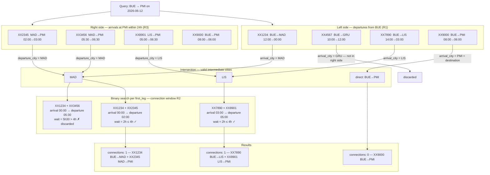

# flights-api

Monorepo containing two services:

| Service | Responsibility | Port |
|---|---|---|
| `journeys-api` | Searches and combines flight journeys | 8000 |
| `flight-events-api` | Stub repository of individual flight events | 8001 |

---

## Requirements

- [Docker](https://docs.docker.com/get-docker/) and Docker Compose
- [Poetry](https://python-poetry.org/docs/#installation) (for running tests locally)
- Python 3.12+

---

## Running with Docker Compose

From the repository root:

```bash
docker compose up --build
```

All three services (`journeys-api`, `flight-events-api`, `redis`) start together. The `journeys-api` waits for both `redis` and `flight-events-api` to be healthy before accepting requests.

| Service | URL | Interactive docs |
|---|---|---|
| journeys-api | http://localhost:8000 | http://localhost:8000/docs |
| flight-events-api | http://localhost:8001 | http://localhost:8001/docs |

To stop:

```bash
docker compose down
```

To stop and remove volumes (clears Redis cache):

```bash
docker compose down -v
```

---

## Running tests

Tests live inside `journeys-api/` and require no running infrastructure — Redis is replaced by `fakeredis` and the external API is mocked.

```bash
cd journeys-api

# Install dependencies (first time only)
poetry install

# Run all tests with verbose output
poetry run pytest -v

# Run only unit tests
poetry run pytest tests/unit -v

# Run only integration tests
poetry run pytest tests/integration -v
```

Expected output:

```
29 passed in ~0.3s
```

---

## Manual testing with curl

### Search for a direct flight

```bash
curl "http://localhost:8000/journeys/search?date=2026-06-12&from=BUE&to=PMI"
```

### Search for a journey with a layover

```bash
curl "http://localhost:8000/journeys/search?date=2026-06-12&from=BUE&to=MAD"
```

### Search with multiple intermediate cities

```bash
curl "http://localhost:8000/journeys/search?date=2026-06-12&from=GRU&to=PMI"
```

### Search that returns no results

```bash
curl "http://localhost:8000/journeys/search?date=2026-06-12&from=BUE&to=NYC"
```

### Trigger a 400 — same origin and destination

```bash
curl "http://localhost:8000/journeys/search?date=2026-06-12&from=BUE&to=BUE"
```

### Trigger a 422 — missing parameter

```bash
curl "http://localhost:8000/journeys/search?from=BUE&to=PMI"
```

### Inspect raw flight events (stub)

```bash
curl "http://localhost:8001/flight-events"
```

---

## Environment variables (journeys-api)

| Variable | Default | Description |
|---|---|---|
| `FLIGHT_EVENTS_API_URL` | `http://localhost:8001` | Base URL of the flight events service |
| `REDIS_URL` | `redis://localhost:6379` | Redis connection string |
| `CACHE_TTL` | `3600` | Cache time-to-live in seconds |

These are set automatically when running via Docker Compose. Override them in a `.env` file inside `journeys-api/` for local development without Docker.

---

---

## Search algorithm (journeys-api)

### Why not a simple nested loop?

A nested loop iterating over all `(first_leg, second_leg)` pairs has **O(N²)** complexity. As the number of flight events grows, the cost grows quadratically — checking pairs that will never produce a valid result.

The algorithm avoids this by reducing candidates at each step before any pairing happens, combining three techniques: **pre-indexing**, **bidirectional filtering**, and **binary search**.

---

### Step 1 — Pre-indexing (O(N log N), done once at cache load)

Instead of a flat list, the events are organized into two dictionaries the moment they are loaded from cache:

```
departures[city] → list of events departing from city, sorted by departure_datetime
arrivals[city]   → list of events arriving at city, sorted by departure_datetime
```

Sorting happens once when the cache is populated. Every subsequent search reads from already-sorted structures, paying zero sorting cost.

---

### Step 2 — Filter cheapest constraints first

Before comparing any pair of flights, the algorithm reduces the candidate sets:

**R1 — departure date** (applied to first legs):
```
first_legs = departures[origin] WHERE departure_date == requested_date
```
This typically eliminates most events in the index immediately, since only a fraction of flights depart on any given day from a given city.

**R3 — total duration ≤ 24h** (applied to second legs):
```
second_legs = arrivals[destination] WHERE arrival_datetime <= earliest_first_leg_departure + 24h
```
Applied to the right side before any pairing happens. Flights that would make the total trip exceed 24 hours are discarded upfront regardless of which first leg is used.

---

### Step 3 — Bidirectional intersection

Rather than starting only from the origin and blindly expanding to all intermediate cities, the algorithm simultaneously constrains from both ends:

```
left_cities  = { first_leg.arrival_city   for first_leg  in first_legs  }
right_cities = { second_leg.departure_city for second_leg in second_legs }

intermediate_cities = left_cities ∩ right_cities
```

Only cities reachable **from the origin** that also have a flight **to the destination** survive. All other intermediate candidates are discarded before any time-constraint check happens.



---

### Step 4 — Binary search for the connection window (R2)

For each surviving `first_leg`, the valid departure window for a `second_leg` is:

```
window = (first_leg.arrival_datetime, first_leg.arrival_datetime + 4h]
```

Because the second-leg candidates are already sorted by `departure_datetime`, Python's `bisect.bisect_right` locates the start of this window in **O(log k)** instead of scanning from the beginning. Iteration stops as soon as `departure_datetime > window_end`.

---

### Complexity summary

| Phase | Cost |
|---|---|
| Build index + sort | O(N log N) — once per cache TTL |
| Filter first legs (R1) | O(F) |
| Filter second legs (R3) | O(S) |
| Bidirectional intersection | O(F + S) |
| Binary search per first leg (R2) | O(F · log k) |
| Iterate valid matches | O(results) |
| **Total per search** | **O(F · log k + results)** |

Where **N** = total events, **F** = first leg candidates, **S** = second leg candidates, **k** = candidates per intermediate city. In practice all three are much smaller than N.

For a detailed walkthrough see [`journeys-api/README.md`](journeys-api/README.md).

---

## Project structure

```
flights-api/
├── journeys-api/          # Journey search API
│   ├── app/
│   │   ├── main.py        # FastAPI app + lifespan + exception handlers
│   │   ├── config.py      # Settings from environment variables
│   │   ├── exceptions.py  # Custom exception classes
│   │   ├── api/routes/
│   │   │   └── journeys.py
│   │   ├── services/
│   │   │   ├── flight_events.py   # Fetch + Redis cache + index
│   │   │   └── journey_search.py  # Bidirectional search algorithm
│   │   └── models/
│   │       ├── flight_event.py
│   │       └── journey.py
│   ├── tests/
│   │   ├── unit/          # Algorithm tests (no I/O)
│   │   └── integration/   # Endpoint tests (fakeredis + mocked API)
│   ├── pyproject.toml
│   └── README.md          # Algorithm deep-dive
├── flight-events-api/     # Flight events stub
│   ├── app/main.py
│   ├── data.json
│   └── pyproject.toml
├── docker-compose.yml
└── README.md              # This file
```
