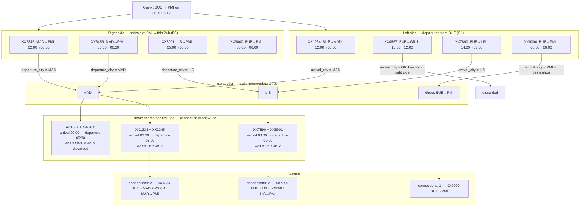
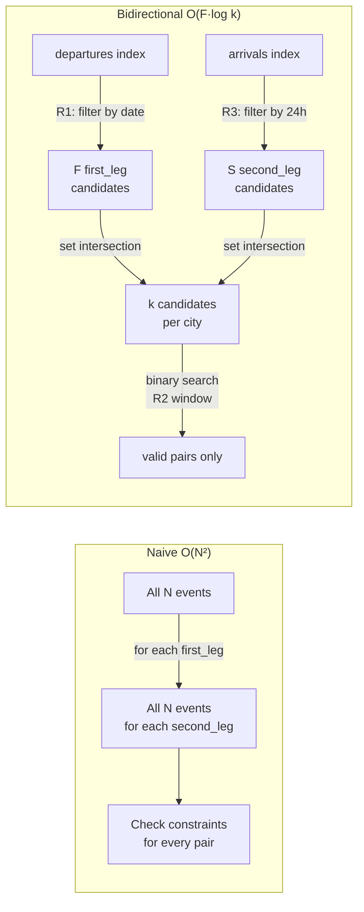

# journeys-api

REST API that searches for flight journeys by combining individual flight events fetched from the `flight-events-api`.

## Endpoint

```
GET /journeys/search?date=YYYY-MM-DD&from=XXX&to=XXX
```

| Parameter | Type   | Description                        |
|-----------|--------|------------------------------------|
| `date`    | string | Departure date in `YYYY-MM-DD` format |
| `from`    | string | Origin city (3-letter IATA code)   |
| `to`      | string | Destination city (3-letter IATA code) |

**Response:**

```json
[
  {
    "connections": 1,
    "path": [
      {
        "flight_number": "XX1234",
        "from": "BUE",
        "to": "MAD",
        "departure_time": "2026-06-12 12:00",
        "arrival_time": "2026-06-13 00:00"
      }
    ]
  },
  {
    "connections": 2,
    "path": [
      {
        "flight_number": "XX1234",
        "from": "BUE",
        "to": "MAD",
        "departure_time": "2026-06-12 12:00",
        "arrival_time": "2026-06-13 00:00"
      },
      {
        "flight_number": "XX2345",
        "from": "MAD",
        "to": "PMI",
        "departure_time": "2026-06-13 02:00",
        "arrival_time": "2026-06-13 03:00"
      }
    ]
  }
]
```

`connections` represents the number of flight segments in the journey (1 = direct, 2 = one stop).

## Business rules (v1)

- Maximum of **2 flight segments** per journey.
- Total journey duration must not exceed **24 hours** (from first departure to last arrival).
- Layover time between two segments must be **between 0 and 4 hours** (exclusive lower bound, inclusive upper bound).
- All datetimes are in **UTC**.

---

## Search algorithm

### Why not a simple nested loop?

A nested loop iterating over all `(first_leg, second_leg)` pairs has **O(N²)** complexity. As the number of flight events grows, the cost grows quadratically — checking pairs that will never produce a valid result.

The algorithm avoids this by reducing candidates at each step before any pairing happens, combining three techniques: **pre-indexing**, **bidirectional filtering**, and **binary search**.

---

### Step 1 — Pre-indexing (O(N log N), done once at cache load)

Instead of a flat list, the events are organized into two dictionaries the moment they are loaded from cache:

```
departures[city] → list of events departing from city, sorted by departure_datetime
arrivals[city]   → list of events arriving at city, sorted by departure_datetime
```

Sorting happens once when the cache is populated. Every subsequent search reads from already-sorted structures, paying zero sorting cost.

---

### Step 2 — Filter cheapest constraints first

Before comparing any pair of flights, the algorithm reduces the candidate sets:

**R1 — departure date** (applied to first legs):
```
first_legs = departures[origin] WHERE departure_date == requested_date
```
This typically eliminates most events in the index immediately, since only a fraction of flights depart on any given day from a given city.

**R3 — total duration ≤ 24h** (applied to second legs):
```
second_legs = arrivals[destination] WHERE arrival_datetime <= earliest_first_leg_departure + 24h
```
Applied to the right side before any pairing happens. Flights that would make the total trip exceed 24 hours are discarded upfront regardless of which first leg is used.

---

### Step 3 — Bidirectional intersection

Rather than starting only from the origin and blindly expanding to all intermediate cities, the algorithm simultaneously constrains from both ends:

```
left_cities  = { first_leg.arrival_city  for first_leg  in first_legs  }
right_cities = { second_leg.departure_city for second_leg in second_legs }

intermediate_cities = left_cities ∩ right_cities
```

Only cities reachable **from the origin** that also have a flight **to the destination** survive. All other intermediate candidates are discarded before any time-constraint check happens.

This is the key insight: the algorithm does not need to know the intermediate city upfront. It discovers all valid intermediate cities in O(F + S) using a set intersection, where F is the number of outbound first legs and S is the number of inbound second legs. In the common case where most cities are not connected to the destination, this intersection is very small.

#### Bidirectional search — full flow diagram



#### Why this is faster than a naive nested loop



---

### Step 4 — Binary search for the connection window (R2)

For each surviving `first_leg`, the valid departure window for a `second_leg` is:

```
window = (first_leg.arrival_datetime, first_leg.arrival_datetime + 4h]
```

Because the second-leg candidates are already sorted by `departure_datetime`, Python's `bisect.bisect_right` locates the start of this window in **O(log k)** — where k is the number of candidates for that route — instead of scanning from the beginning. Iteration then stops as soon as `departure_datetime > window_end`.

---

### Complexity summary

| Phase | Cost |
|---|---|
| Build index + sort | O(N log N) — once per cache TTL |
| Filter first legs (R1) | O(F) |
| Filter second legs (R3) | O(S) |
| Bidirectional intersection | O(F + S) |
| Binary search per first leg (R2) | O(F · log k) |
| Iterate valid matches | O(results) |
| **Total per search** | **O(F · log k + results)** |

Where:
- **N** = total flight events in the system
- **F** = flights departing from origin on the requested date (typically small)
- **S** = flights arriving at destination within 24h window (typically small)
- **k** = flights from a given intermediate city to the destination (very small)

In practice, F, S, and k are all much smaller than N, making the per-search cost nearly constant for realistic airline schedules.

---

## Error handling

| Scenario | HTTP status |
|---|---|
| Missing or malformed query parameter | 422 Unprocessable Entity |
| `from` and `to` are the same city | 400 Bad Request |
| `flight-events-api` is unreachable | 503 Service Unavailable |
| `flight-events-api` timed out | 504 Gateway Timeout |
| `flight-events-api` returned an error | 502 Bad Gateway |
| Redis is offline | Degrades gracefully — fetches directly from `flight-events-api` |

---

## Running locally

```bash
# From the monorepo root
docker compose up --build

# Run tests
cd journeys-api
poetry install
poetry run pytest -v
```
